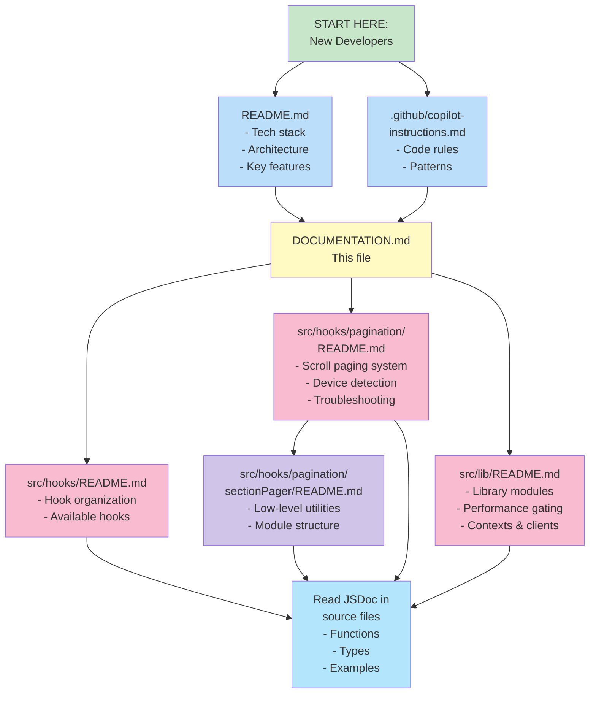

# Documentation Index

Complete guide to the documentation in this project. Every major module includes comprehensive READMEs and JSDoc comments.

### Documentation Map



## Quick Navigation

### For New Developers

1. Start with **[README.md](README.md)** — Overview of tech stack, setup, and key features
2. Read **[.github/copilot-instructions.md](.github/copilot-instructions.md)** — Architecture guidelines and code style rules
3. Explore **[src/hooks/pagination/README.md](src/hooks/pagination/README.md)** — The main scroll paging system

### For Specific Features

| Feature | Documentation |
|---------|---|
| **Scroll paging** | [src/hooks/pagination/README.md](src/hooks/pagination/README.md) |
| **Low-level paging utilities** | [src/hooks/pagination/sectionPager/README.md](src/hooks/pagination/sectionPager/README.md) |
| **Device detection & performance** | [src/lib/performance.ts](src/lib/performance.ts) (JSDoc) |
| **Custom hooks** | [src/hooks/README.md](src/hooks/README.md) |
| **Library utilities** | [src/lib/README.md](src/lib/README.md) |
| **Code style** | [README.md](README.md#code-style--conventions) & [.github/copilot-instructions.md](.github/copilot-instructions.md) |

## Documentation Files

### Root Level

- **[README.md](README.md)** — Main project documentation
  - Tech stack overview
  - Project structure with detailed folder explanations
  - Documentation guide (points to all README files)
  - Code style and conventions
  - Key features and patterns (scroll paging, device adaptation, animation orchestration)
  - Testing and validation guidelines

- **[DOCUMENTATION.md](DOCUMENTATION.md)** — This file; navigation guide for all documentation

- **[.github/copilot-instructions.md](.github/copilot-instructions.md)** — Enforced project guidelines
  - Architecture and stack overview
  - Absolute rules (no duplication, no `any`, fail-fast error handling)
  - Lint rules and patterns (async/await, dependency arrays, etc.)
  - Build and test commands

### src/ Folders

#### Hooks Documentation

- **[src/hooks/README.md](src/hooks/README.md)**
  - Rules for organizing hooks
  - Folders & modules (pagination, responsive, devops, gamedev)
  - Common patterns (async data fetching, TypeScript, dependency arrays)
  - Guide for adding new hooks

- **[src/hooks/pagination/README.md](src/hooks/pagination/README.md)**
  - Complete scroll paging system overview
  - Features, configuration, and how it works
  - HTML attributes (required and optional)
  - Input behavior table
  - Device detection logic
  - Performance considerations
  - Troubleshooting guide

- **[src/hooks/pagination/sectionPager/README.md](src/hooks/pagination/sectionPager/README.md)**
  - Low-level paging utilities (constants, helpers, handlers)
  - Module structure breakdown
  - Integration guide
  - Design rationale (SRP, pure functions, factory pattern)
  - Performance notes

#### Library Documentation

- **[src/lib/README.md](src/lib/README.md)**
  - Overview of all library modules
  - Key functions in performance.ts
  - Animation context and orchestration
  - Scroll container context
  - Supabase client and storage
  - Sound utilities
  - Architecture principles
  - Usage patterns with code examples

#### Components Documentation

- Component READMEs are organized by section:
  - `src/components/ui/README.md` (when available)
  - `src/components/backgrounds/README.md` (when available)
  - `src/components/admin/README.md` (when available)

### styles/ Folder

- **[src/styles/README.md](src/styles/README.md)** (when available)
  - Base styles organization
  - Component-specific CSS files
  - Tailwind CSS v4 setup notes
  - CSS classes and utilities

## Code Documentation Standards

### JSDoc Comments

All major functions include JSDoc comments explaining:

**Example:**
```typescript
/**
 * Brief description of what this function does.
 * More detailed explanation if needed.
 *
 * @param paramName - Description of parameter
 * @returns Description of return value
 *
 * @example
 * const result = functionName(param);
 */
export const functionName = (param: string): boolean => {
  // Implementation
};
```

### Block Separation (React Components & Hooks)

Code is organized into logical blocks with blank line separators:

```typescript
const Component = () => {
  // 1. Responsive config
  const isMobile = useMediaQuery('...');

  // 2. State & refs
  const [state, setState] = useState();

  // 3. Derived values
  const computed = state * 2;

  // 4. Effects
  useEffect(() => { ... }, []);

  // 5. Handlers
  const handleClick = () => { ... };

  return <div>...</div>; // Always blank line before return
};
```

See [README.md#block-separation--react-components--hooks](README.md#code-style--conventions) for complete rules.

## Architecture Decisions

Key architectural documents:

1. **Section Paging System** — [src/hooks/pagination/README.md](src/hooks/pagination/README.md)
   - Why adaptive paging (strong vs constrained devices)
   - Multi-input support (wheel, touch, keyboard)
   - Hero intro lock pattern

2. **Device Capability Detection** — [src/lib/performance.ts](src/lib/performance.ts)
   - Low-end device detection (≤2GB RAM)
   - Memory pressure monitoring
   - Adaptive canvas DPR
   - Mid-tier device gating for scroll paging

3. **Hook Organization** — [src/hooks/README.md](src/hooks/README.md)
   - Domain-first organization
   - When to extract logic to hooks
   - Type-safe hook patterns

4. **Code Quality** — [.github/copilot-instructions.md](.github/copilot-instructions.md)
   - No duplication rule
   - Type safety enforcement
   - Error handling patterns
   - Async/await requirements

## Linting & Validation

### Rules Enforced

- ✅ **No duplication**: Functions or UI shells repeated in 2+ files must be extracted
- ✅ **Type safety**: No `any` types; use proper interfaces and type guards
- ✅ **Error handling**: Fail-fast; always check Supabase/fetch `error` fields
- ✅ **Async/await**: Never use `.then()` chains; use `async/await` with `try/catch`
- ✅ **Dependencies**: All `useEffect`/`useCallback`/`useMemo` dependencies must be included
- ✅ **Logging**: Only `console.error` and `console.warn` allowed (no `console.log`)
- ✅ **Unused variables**: Prefix with `_` or remove entirely

### Validation Commands

```bash
npm run lint    # ESLint + Biome formatting (0 errors required)
npm run build   # TypeScript compilation + Vite bundling (must succeed)
```

## Contributing

Before committing:

1. **Run validation**: `npm run lint && npm run build`
2. **Follow conventions**: Check [README.md#code-style--conventions](README.md#code-style--conventions)
3. **Add documentation**: JSDoc on functions, README updates for new features
4. **No duplication**: Extract repeated logic to `src/lib/` or `src/hooks/`
5. **Type-safe**: No `any` types; fix underlying issues instead

## Search Tips

### Find documentation for a specific module

```bash
# From project root:
find . -name "README.md" | grep <module-name>
```

### Find JSDoc for a function

Look at the function's file — all major functions are documented with JSDoc comments immediately above their definition.

### Find code examples

Check the "Common Patterns" sections in:
- [src/hooks/README.md](src/hooks/README.md) — Hook patterns
- [src/lib/README.md](src/lib/README.md) — Usage patterns for lib utilities
- [src/hooks/pagination/README.md](src/hooks/pagination/README.md) — Paging system setup

## Additional Resources

### External Documentation

- [React 19 Docs](https://react.dev) — Latest React features
- [TypeScript Handbook](https://www.typescriptlang.org/docs/) — Type system
- [Vite Guide](https://vitejs.dev) — Build tool and configuration
- [Tailwind CSS v4](https://tailwindcss.com/docs/v4) — Styling framework
- [Three.js Docs](https://threejs.org/docs/) — 3D graphics library
- [Supabase Docs](https://supabase.com/docs) — Backend and database
- [Cloudflare R2](https://developers.cloudflare.com/r2/) — Media storage

### Internal Checklists

- **Before implementing a new feature**: Check [src/hooks/README.md](src/hooks/README.md#adding-new-hooks)
- **Before extracting a hook**: Check [src/hooks/README.md](src/hooks/README.md) rules
- **Before writing a component**: Check [README.md#code-style--conventions](README.md#code-style--conventions)

---

**Last updated**: April 2026 | **Documentation version**: 1.0
