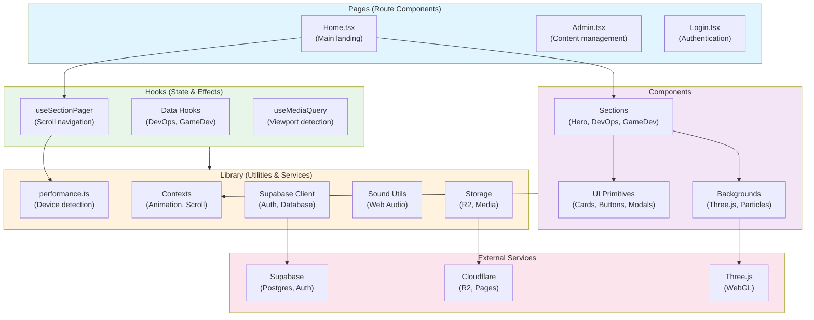

# Guy Erreich — Personal Portfolio

My personal portfolio website — a highly interactive, visually rich single-page app built with React 19, TypeScript, and Three.js. Features immersive 3D WebGL backgrounds, GSAP-orchestrated animations, and a headless admin panel backed by Supabase and Cloudflare R2.

## Tech Stack

| Layer         | Technology                            |
| ------------- | ------------------------------------- |
| Framework     | React 19 + TypeScript + Vite          |
| Styling       | Tailwind CSS v4                       |
| 3D / WebGL    | Three.js via React Three Fiber & Drei |
| Animations    | GSAP, Framer Motion                   |
| Particles     | tsparticles                           |
| Backend / DB  | Supabase (Postgres + Auth)            |
| Media Storage | Cloudflare R2                         |
| Routing       | React Router v7                       |
| Deployment    | Cloudflare Pages                      |

## Project Structure

```
src/
├── components/           # React UI components
│   ├── backgrounds/      # 3D & particle effect components
│   │   ├── three/        # Three.js / React Three Fiber scenes
│   │   └── tsparticles/  # 2D particle effects
│   ├── admin/            # Admin panel for managing content
│   ├── ui/               # Reusable UI building blocks
│   └── pages/            # Route-level page components
├── hooks/                # Custom React hooks (organized by domain)
│   ├── pagination/       # Section paging logic (useSectionPager)
│   ├── responsive/       # Media query hooks
│   ├── devops/           # DevOps section data & filtering
│   └── gamedev/          # GameDev section data & filtering
├── lib/                  # Utilities, contexts, & external clients
│   ├── performance.ts    # Device detection & adaptive quality gating
│   ├── AnimationContext  # Global animation orchestration
│   ├── ScrollContainerContext # Scroll state provider
│   ├── supabase.ts       # Supabase client
│   ├── storage/          # File upload/download (R2, Supabase)
│   └── sound/            # Web Audio utilities
├── styles/               # Global & component-specific CSS
├── pages/                # Top-level route components (Home, Admin, Login)
└── App.tsx              # Router configuration
```

### Architecture Layers



## Documentation

Each major folder includes a comprehensive `README.md` explaining its purpose, modules, and usage patterns:

- **[src/hooks/pagination/README.md](src/hooks/pagination/README.md)** — Complete scroll paging system with multi-input support
- **[src/hooks/pagination/sectionPager/README.md](src/hooks/pagination/sectionPager/README.md)** — Low-level paging utilities (constants, helpers, handlers)
- **[src/hooks/README.md](src/hooks/README.md)** — All custom hooks, patterns, and best practices
- **[src/lib/README.md](src/lib/README.md)** — Library utilities, contexts, and external service clients

## Code Documentation

All major functions include comprehensive **JSDoc comments** explaining:
- Purpose and behavior
- Parameters and return types
- Usage examples
- Performance considerations
- Related functions

### Example: Well-Documented Function

```typescript
/**
 * Determine if device should use native browser smooth-scroll instead of custom JS animation.
 * Conservative gate for JS-heavy scroll paging: low-end, memory-pressured, or mid-tier devices.
 *
 * @returns true if device should use native smooth scroll, false if custom rAF animation is acceptable
 *
 * @example
 * const useNativeScroll = isMidTierOrConstrainedDevice();
 * if (useNativeScroll) {
 *   section.scrollIntoView({ behavior: 'smooth' });
 * } else {
 *   animateScrollWith(easeInOutCubic, 1400ms);
 * }
 */
export const isMidTierOrConstrainedDevice = (): boolean => {
  // Implementation...
};
```

## Getting Started

### Prerequisites

- Node.js (version specified in `.node-version`)
- npm

### Environment Variables

Create a `.env.local` file at the root with the following variables:

```env
VITE_SUPABASE_URL=
VITE_SUPABASE_ANON_KEY=
```

R2 credentials are **not** stored in the browser bundle. They live as Supabase secrets and are used exclusively inside the `r2-presign` edge function. Set them once via the Supabase CLI:

```bash
supabase secrets set R2_ACCOUNT_ID=<your-cloudflare-account-id>
supabase secrets set R2_ACCESS_KEY_ID=<your-r2-access-key>
supabase secrets set R2_SECRET_ACCESS_KEY=<your-r2-secret-key>
supabase secrets set R2_BUCKET_NAME=<your-bucket-name>
supabase secrets set R2_PUBLIC_URL=<your-r2-public-url>
```

Deploy the edge function after setting secrets:

```bash
supabase functions deploy r2-presign
```

### Install & Run

```bash
npm install
npm run dev
```

### Other Commands

```bash
npm run build   # Type-check + production build
npm run lint    # ESLint + Biome checks
npm run preview # Serve the production build locally
```

## Code Style & Conventions

This project enforces strict code quality standards. Refer to [.github/copilot-instructions.md](.github/copilot-instructions.md) for complete architecture guidelines. Key rules:

### No Duplication
- **Function duplication**: If a function is copied to 2+ files, extract it to `src/lib/` and parameterize differing parts.
- **UI duplication**: If layout, interaction, or class chains repeat in 2+ UI files, extract to a shared component or hook.

### TypeScript & Type Safety
- **No `any`**: Use specific types or define interfaces. For browser APIs, use type guards: `(window as Window & { webkit?: typeof AudioContext })`
- **No `@ts-nocheck`**: Fix the underlying type issue instead.

### Error Handling
- **Fail-fast in system logic**: Always check Supabase/fetch `error` fields. Never silently swallow failures.
- **Async/await only**: Never use `.then()/.catch()` chains. Use `async/await` with `try/catch` in `useEffect`: `void (async () => { ... })()`
- **No `console.log`**: ESLint enforces `noConsole`. Only `console.error` and `console.warn` allowed (with justification).

### Block Separation (React Components & Hooks)

Within function bodies, separate logical groups with blank lines. Standard order:

```typescript
const MyHook = (param: string) => {
  // 1. Responsive config
  const isMobile = useMediaQuery('...');

  // 2. State & refs
  const [count, setCount] = useState(0);
  const ref = useRef<HTMLElement>(null);

  // 3. Derived values (pure computations)
  const doubled = count * 2;

  // 4. Effects (side-effects, listeners, etc.)
  useEffect(() => { ... }, []);

  // 5. Handlers & event callbacks
  const handleClick = () => { ... };

  // blank line before return
  return <div>...</div>;
};
```

**Key rules:**
- Never add blank lines *within* tightly-related groups (e.g., consecutive `useState` calls)
- Add blank line between sibling handler functions
- Always add blank line before `return` statement
- Always add blank line between JSX children that represent distinct logical sections

## Key Features & Patterns

### Adaptive Scroll Paging

The site uses a smart paging system that adapts to device capability:

- **Strong devices** (≥8GB RAM, ≥8 cores, ≥1440px): Custom 1400ms easeInOutCubic smooth-scroll animation
- **Mid-tier/constrained**: Native browser `scrollIntoView({ behavior: 'smooth' })`

This adaptive approach preserves the cinematic intro feel on capable hardware while ensuring smooth performance on mobile and budget devices.

**Key files:**
- [src/hooks/pagination/useSectionPager.ts](src/hooks/pagination/useSectionPager.ts) — Main paging hook (orchestration)
- [src/lib/performance.ts](src/lib/performance.ts) — Device detection logic
- [.github/copilot-instructions.md](.github/copilot-instructions.md) — Architecture guidelines

### Multi-Input Navigation

Users can navigate sections via:

| Input | Behavior |
|-------|----------|
| **Wheel** (desktop) | 12px delta threshold; skips if Ctrl pressed or on nested scrollables |
| **Touch** (mobile/trackpad) | 40px delta threshold; gesture state lock prevents duplicate paging |
| **Keyboard** | Arrow/Page/Space keys; respects text input focus |

### Hero Intro Lock

On first visit, the hero section locks scrolling for ~25 seconds to allow the cinematic intro animation to play uninterrupted. Returning visitors (via cookie) skip directly to the fast reveal.

**Key files:**
- [src/components/Hero.tsx](src/components/Hero.tsx) — Hero timing logic
- [src/hooks/pagination/useSectionPager.ts](src/hooks/pagination/useSectionPager.ts) — Lock implementation

### Device-Aware Rendering

The project uses performance detection to gate expensive features:

```typescript
// Example: Only render WebGL on capable devices
const shouldRenderWebGL = !isLowEndDevice() && !isMemoryPressureHigh();

// Example: Reduce canvas DPR under memory pressure
const dpr = getAdaptiveCanvasDPR();
```

**Key module:** [src/lib/performance.ts](src/lib/performance.ts)

### Sound & Web Audio

Audio is initialized safely (respecting browser autoplay policies) and cleanup is handled automatically:

```typescript
// Entrance sounds fade in over 1.5s
playEntranceSound('heroReveal');

// Interaction sounds are short and punchy
playInteractionSound('buttonClick');

// Respects prefers-reduced-motion media query
```

**Key files:**
- [src/lib/sound/audioContext.ts](src/lib/sound/audioContext.ts) — AudioContext lifecycle
- [src/lib/sound/entranceSounds.ts](src/lib/sound/entranceSounds.ts) — Sequence sounds
- [src/lib/sound/interactionSounds.ts](src/lib/sound/interactionSounds.ts) — Feedback sounds

### Animation Orchestration

Complex animations across the site are coordinated via [AnimationOrchestrator](src/lib/AnimationOrchestrator.ts) and exposed through [AnimationContext](src/lib/AnimationContext.tsx). This prevents animation conflicts and allows global state (e.g., "is hero intro locked?") to be queried from anywhere.

## Testing & Validation

### Pre-Commit Checks

Before pushing, run:

```bash
npm run lint     # 0 errors required
npm run build    # Must succeed (TypeScript, bundling)
```

### Lint Rules (Enforced)

- ✅ No duplication (functions or UI shells)
- ✅ No `any` types
- ✅ No `console.log` (only `console.error` / `console.warn`)
- ✅ All `useEffect` dependencies included
- ✅ No bare `catch (e) {}` without justification
- ✅ All async functions use `async/await` (never `.then()` chains)

See [.github/copilot-instructions.md](.github/copilot-instructions.md) §9–13 for detailed patterns.


## CI / CD

| Workflow            | Trigger                     | Description                                       |
| ------------------- | --------------------------- | ------------------------------------------------- |
| `test.yml`          | push / PR → `dev`, `master` | Lint + build validation                           |
| `deploy.yml`        | push → `dev`                | Deploy to Cloudflare Pages                        |
| `license-check.yml` | push → `dev`                | Verify MIT headers on all `src/` files            |
| `pr-labeler.yml`    | PR opened / updated         | Auto-apply labels from file paths and branch name |
| `codeql.yml`        | push / PR → `dev`, `master` | GitHub CodeQL security analysis                   |

## License

[MIT](LICENSE) © Guy Erreich
