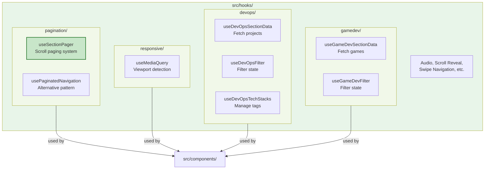

# Custom Hooks (`src/hooks/`)

Reusable React hooks organized by domain. Each hook encapsulates state management, effects, and lifecycle logic for a specific feature or behavior.

### Hook Organization by Domain



## Rules

- **Domain-first organization**: Hooks grouped by responsibility (e.g., `pagination/`, `responsive/`, `gamedev/`)
- **Reusable only**: If logic is repeated in 2+ components, extract to a hook here
- **No component logic in components**: All stateful/effect logic should become a hook if possible
- **Focused exports**: Each hook should do one thing well and return a typed data structure

## Folders & Modules

### `pagination/`
Complete scroll paging system for single-page apps.

#### `useSectionPager`
Main hook for smooth section-to-section transitions via wheel, touch, and keyboard input.
- **Features**: Adaptive paging (custom rAF on strong devices, native smooth on constrained), multi-input support, hero intro lock, touch gesture management
- **Setup**: Attach ref to scroll container, mark sections with `.snap-section`
- **Read first**: [pagination/README.md](./pagination/README.md)

#### `usePaginatedNavigation`
Alternative pagination hook (used elsewhere; see `pagination/useSectionPager.ts` for main implementation).

**Architecture of `useSectionPager`:**
```
useSectionPager (orchestration) — public API
├── sectionPager/constants.ts — tuning values
├── sectionPager/helpers.ts — pure utility functions
└── sectionPager/handlers.ts — event factory
```

### `responsive/`
Media query and viewport state hooks.

#### `useMediaQuery`
Detect viewport size and orientation changes.

**Typical usage:**
```typescript
const isMobile = useMediaQuery('(max-width: 640px)');
const isTablet = useMediaQuery('(min-width: 641px) and (max-width: 1024px)');
```

### `devops/`
Data and filter state for DevOps section.

#### `useDevOpsSectionData`
Fetch and normalize DevOps project data from Supabase.

#### `useDevOpsFilter`
Manage tech stack filter state and provide filtered project list.

#### `useDevOpsTechStacks`
Fetch available tech stack tags and manage selection.

### `gamedev/`
Data and filter state for GameDev section.

#### `useGameDevSectionData`
Fetch and normalize GameDev project data from Supabase.

#### `useGameDevFilter`
Manage game type filter state and provide filtered game list.

## Common Patterns

### Async Data Fetching

```typescript
// ✅ Do: use the repo-standard async IIFE pattern with cancellation and error handling
useEffect(() => {
  let cancelled = false;

  void (async () => {
    try {
      const data = await fetch(...);
      if (!cancelled) setData(data);
    } catch (error) {
      if (!cancelled) setError(error instanceof Error ? error.message : 'Unknown');
    }
  })();

  return () => { cancelled = true; };
}, [deps]);
```

### Custom Hooks with TypeScript

```typescript
interface UseFetchResult<T> {
  data: T | null;
  loading: boolean;
  error: string | null;
}

export const useFetch = <T,>(url: string): UseFetchResult<T> => {
  const [data, setData] = useState<T | null>(null);
  const [loading, setLoading] = useState(true);
  const [error, setError] = useState<string | null>(null);

  useEffect(() => {
    // Fetch logic
  }, [url]);

  return { data, loading, error };
};
```

### Dependency Arrays

Always include every variable referenced in useEffect/useCallback/useMemo dependencies:

```typescript
// ❌ Missing dependency 'config'
useEffect(() => {
  document.title = config.value;
}, []); // ESLint error!

// ✅ Correct
useEffect(() => {
  document.title = config.value;
}, [config]); // Dependency included
```

## Adding New Hooks

1. **Check for duplicates**: Search `src/` for the logic you need — it might already exist
2. **Organize by domain**: Create a folder if this is the first hook in a domain (e.g., `analytics/`)
3. **Export types**: Define and export the return type (e.g., `UseFetchResult<T>`)
4. **Add JSDoc**: Document parameters, return value, and usage examples
5. **No side-effects**: Keep hooks pure; complex orchestration goes in components

## See Also

- [../lib/README.md](../lib/README.md) — Library utilities (performance, contexts, etc.)
- [../components/README.md](../components/README.md) — React components
- [../../.github/copilot-instructions.md](../../.github/copilot-instructions.md) — Project guidelines
