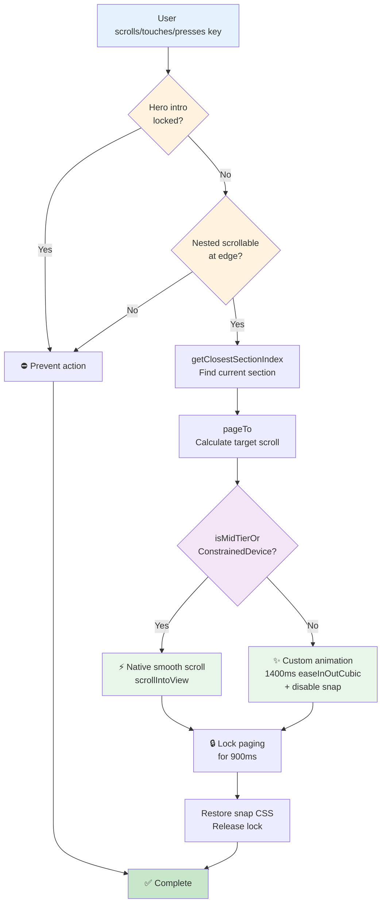
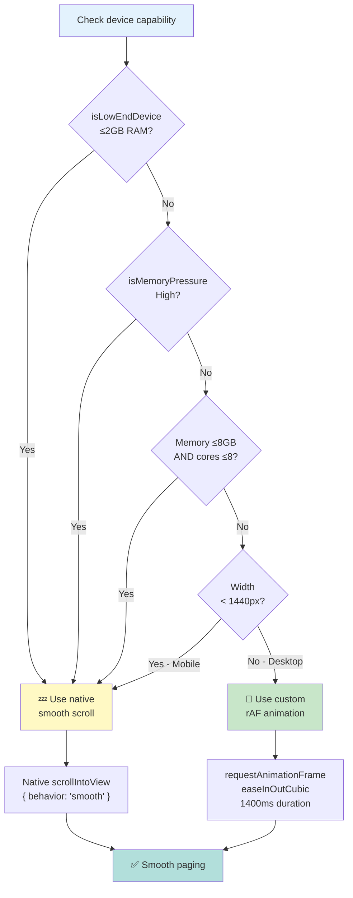

# Section Paging Hook (`useSectionPager`)

A complete scroll paging system for single-page apps with smooth section-to-section transitions. Handles wheel, touch, and keyboard input with adaptive behavior for different device capabilities.

## Quick Start

```typescript
import { useRef } from 'react';
import { useSectionPager } from '../hooks/pagination/useSectionPager';

export const Home = () => {
  const mainRef = useRef<HTMLElement>(null);
  useSectionPager({ mainRef });

  return (
    <main ref={mainRef} className="h-screen overflow-y-auto overflow-x-hidden">
      <section className="snap-section h-screen">Hero</section>
      <section className="snap-section h-screen">DevOps</section>
      <section className="snap-section h-screen">GameDev</section>
      <section className="snap-section h-screen">Footer</section>
    </main>
  );
};
```

## Features

- **Adaptive Paging**: Custom smooth scroll (1400ms easeInOutCubic) on strong devices, native smooth scroll on mid-tier/constrained hardware.
- **Multi-input**: Wheel, touch (mobile + trackpad), and keyboard navigation.
- **Hero Lock**: Prevents scrolling through initial cinematic intro sequence.
- **Touch Gesture Management**: Active state tracking prevents duplicate paging from simultaneous touchmove+touchend.
- **Nested Scrollable Awareness**: Respects overflow containers and text inputs — paging only when scrollable element is at edge.
- **Cleanup**: Full event listener removal and animation frame cancellation on unmount.

## Configuration

All tuning values live in `sectionPager/constants.ts` and can be adjusted without touching orchestration logic:

```typescript
export const PAGE_SCROLL_DURATION_MS = 1400;      // Custom animation duration
export const PAGE_SCROLL_LOCK_MS = 900;           // Cooldown between pages
export const WHEEL_DELTA_THRESHOLD = 12;          // Wheel sensitivity
export const TOUCH_DELTA_THRESHOLD = 40;          // Touch sensitivity
```

## How It Works



### Device Adaptation Decision Tree



1. **Setup**: Collects all `.snap-section` elements and the `#about` (hero) section.
2. **Input Routing**: Attaches passive/non-passive listeners based on event type.
   - `wheel` (non-passive): Can prevent default to block scroll.
   - `touchstart` (passive): Just track starting position.
   - `touchmove` (non-passive): Prevent native scroll, check gesture state.
   - `touchend` (passive): Final delta check if not handled by touchmove.
   - `keydown` (global): Check focus, allow arrow/page/space keys.
3. **Device-Aware Paging**: 
   - **Strong devices**: Custom 1400ms smooth scroll animation (easeInOutCubic).
   - **Mid-tier/constrained**: Native `scrollIntoView({ behavior: 'smooth' })`.
4. **Scroll Lock**: During hero intro, paging is prevented while the hero section is marked with `data-no-swipe-page`. Paging resumes when that attribute is removed by the hero intro flow.
5. **Cleanup**: Removes all listeners and cancels pending animations on unmount.

## Architecture

```
useSectionPager (orchestration)
├── constants (tuning values)
├── helpers (pure math/DOM checks)
└── handlers (event factory)
```

- **`useSectionPager.ts`**: Main hook — orchestrates lifecycle, manages timeouts/rafs, calls handlers.
- **`sectionPager/constants.ts`**: Configuration values only.
- **`sectionPager/helpers.ts`**: Pure utility functions — no side effects, easily testable.
- **`sectionPager/handlers.ts`**: Event handler factory — encapsulates gesture state and event logic.

## HTML Attributes

### Required

- **`ref={mainRef}` on `<main>`**: The scroll container. Use fixed viewport height and vertical scrolling (`overflow-y-auto`).
- **`className="snap-section"` on section containers**: Identifies pageable sections.

### Optional

- **`id="about"` on hero section**: Identifies the intro lock target.
- **`data-no-swipe-page="true"` on parent of hero**: Prevents paging while intro is active.

## Input Behavior

| Input | Threshold | Behavior |
|-------|-----------|----------|
| **Wheel (desktop)** | 12px delta | Next/prev section; blocked by hero lock; skipped if ctrl key pressed |
| **Touch (mobile/trackpad)** | 40px delta | Gesture state lock prevents duplicate paging; native momentum is prevented |
| **Keyboard** | Single press | Arrow/Page/Space keys page; respects interactive elements (input, textarea) |

## Device Detection

Adaptive paging is controlled by `isMidTierOrConstrainedDevice()` from `lib/performance.ts`:

- **Strong devices**: ≥8GB memory, ≥8 CPU cores, ≥1440px width → Custom smooth scroll.
- **Mid-tier/constrained**: <8GB memory OR <8 CPU cores OR <1440px width → Native smooth scroll.

## Performance Considerations

- **Gesture State Lock**: Prevents rapid `pageByDelta` calls during touch; resets after paging completes.
- **RAF Management**: All animation frames are tracked and cancelled on unmount.
- **Hero Lock Check**: O(1) lookup of hero section `data-no-swipe-page` attribute.
- **Snap Disable/Restore**: CSS `scroll-snap-type` is temporarily disabled during custom animation to prevent jarring behavior.
- **Section Refresh**: Sections are re-queried on window resize (in case DOM changed).

## Troubleshooting

### Paging is jerky or stutters
- Ensure main element uses fixed `height` (usually `h-screen`) and vertical scrolling (`overflow-y-auto`).
- Check if other event listeners are also preventing default (can cause preventDefault conflicts).
- Verify device is not memory-constrained; check `isMidTierOrConstrainedDevice()` logic.

### Hero intro doesn't lock scrolling
- Confirm hero section has `id="about"` and `data-no-swipe-page="true"` while intro is active.
- Check that hero intro flow removes `data-no-swipe-page` after lock release.

### Touch doesn't work on mobile
- Ensure `touchmove` handler is attached with `{ passive: false }` (allows preventDefault).
- Check that no parent container has `pointer-events: none`.
- Verify touch events are not being consumed by nested scrollable panels.

## See Also

- [lib/performance.ts](../../lib/performance.ts) — Device detection helpers.
- [sectionPager/README.md](./sectionPager/README.md) — Low-level utility documentation.
