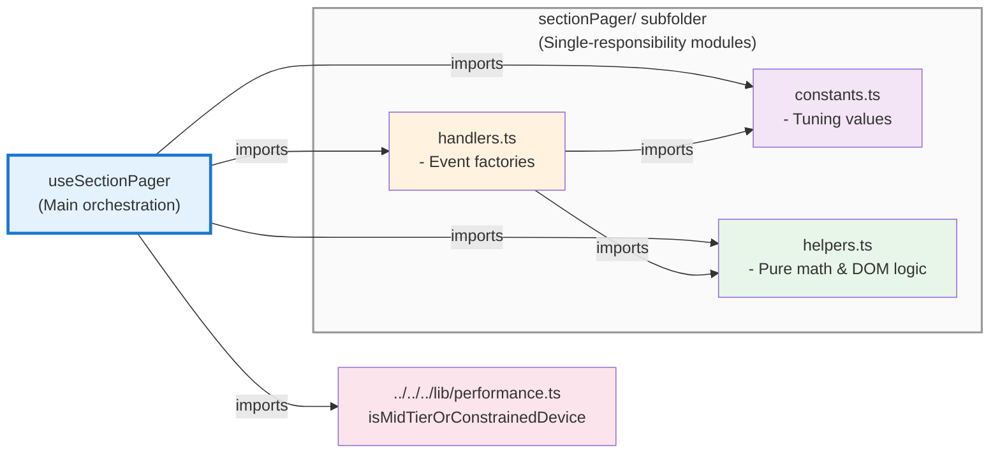

# Section Pager Utilities

Low-level utilities for section-based scroll paging behavior. This module is split into focused, single-responsibility files for maintainability and testability.

## Module Structure

### Dependency Graph



### Files & Responsibilities

### `constants.ts`
Centralized tuning values for paging behavior. Adjust these to fine-tune the paging experience across devices.

- **`PAGE_SCROLL_DURATION_MS`** (1400): Duration of custom smooth-scroll animation on strong devices (easeInOutCubic).
- **`PAGE_SCROLL_LOCK_MS`** (900): Cooldown period between consecutive page transitions.
- **`HERO_LOCK_ACTIVE_SCROLL_TOP_RATIO`** (0.6): Ratio of viewport height at which hero intro lock remains active.
- **`WHEEL_DELTA_THRESHOLD`** (12): Minimum wheel delta (px) to trigger page advance.
- **`TOUCH_DELTA_THRESHOLD`** (40): Minimum touch delta (px) to trigger page advance.

### `helpers.ts`
Pure utility functions for scroll calculations and element eligibility checks. These are testable and reusable.

- **`easeInOutCubic(t: number)`**: Cubic easing function (0–1) for smooth scroll animation.
- **`getClosestSectionIndex(main, sections)`**: Find the nearest visible section by vertical distance.
- **`getTargetScrollTop(section, scroller)`**: Calculate absolute scroll offset for a section.
- **`canPageFromTarget(main, target, deltaY)`**: Determine if paging is allowed from a given event target (respects `data-no-swipe-page` attribute and nested scrollable containers).
- **`isInteractiveElement(target)`**: Check if target is a text input, textarea, or contenteditable.

### `handlers.ts`
Factory function that creates all input event handlers (wheel, touch, keyboard). Encapsulates gesture state management and input-specific logic.

**Factory signature:**
```typescript
createSectionPagerHandlers({
  isHeroIntroScrollLocked: () => boolean,
  canPageFromTarget: (target, deltaY) => boolean,
  pageByDelta: (delta: number) => void,
  touchState: TouchGestureState
}) => ({
  onWheel, onTouchStart, onTouchMove, onTouchEnd, onTouchCancel, onKeyDown
})
```

**Key behavior:**
- **Wheel events**: Respects `ctrlKey` (browser zoom), threshold, and hero lock.
- **Touch events**: Manages gesture state to prevent duplicate paging from touchmove+touchend.
- **Keyboard**: ArrowUp/PageUp/Down/Space keys page sections (respects hero lock and interactive elements).

## Integration

See `useSectionPager.ts` for how these utilities are orchestrated together.

## Design Rationale

- **Separation of concerns**: Constants (config), helpers (logic), handlers (I/O).
- **Pure functions**: Helpers have no side effects and are easily testable.
- **Factory pattern**: Handlers encapsulate mutable state (touchState) and closure over orchestration callbacks.
- **Device-agnostic**: All input handling is identical; device detection happens in the orchestration layer.

## Performance Notes

- Helpers are called frequently during scroll/input but do minimal DOM work (getBoundingClientRect is cached locally).
- Touch gesture state prevents redundant calls to `pageByDelta`.
- Hero lock check is O(1) — just reads a data attribute and scroll position.
