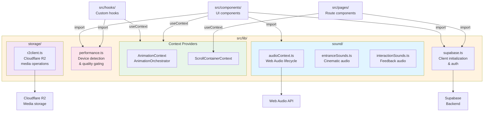

# Library (`src/lib/`)

Utilities, contexts, and external service clients. This folder contains no React components — only reusable logic and configuration.

### Module Organization



## Key Modules

### `performance.ts`
Device capability detection and adaptive quality gating for animations, canvas rendering, and scroll behavior.

**Key functions:**
- `isLowEndDevice()` — Detect truly ancient devices (≤2GB RAM)
- `getCanvasDPR()` — Get appropriate pixel ratio for Three.js canvas
- `isMemoryPressureHigh()` — Check runtime heap usage
- `getAdaptiveCanvasDPR()` — Combine base DPR with memory pressure
- `isMidTierOrConstrainedDevice()` — Gate for custom vs native smooth scroll

**Usage in paging:** Section pager uses `isMidTierOrConstrainedDevice()` to decide between custom 1400ms rAF animation (strong devices) or native `scrollIntoView({ behavior: 'smooth' })` (constrained).

### `AnimationContext.tsx` & `AnimationOrchestrator.ts`
Global animation state and orchestration for coordinating complex sequences across the site.

- **Context**: Provides `AnimationOrchestrator` to any component needing animation state (hero intro lock, section transitions, etc.)
- **Orchestrator**: Manages animation lifecycle, timing, and cross-component coordination

### `ScrollContainerContext.tsx`
React context exposing the main scroll container ref to child components (e.g., sections, overlays) that need to read scroll position or trigger paging.

**Usage:**
```typescript
const scrollRef = useContext(ScrollContainerContext);
const scrollTop = scrollRef.current?.scrollTop;
```

### `supabase.ts`
Supabase client initialization and auth state management.

- Initializes `supabaseClient` with URL and anonymous key
- Provides auth session listeners
- No database/storage logic here — that lives in `storage/`

### `storage/`

#### `r2client.ts`
Cloudflare R2 (S3-compatible) integration for media uploads/downloads.

- Uses Supabase edge functions to request signed URLs (auth + CORS safe)
- Never exposes R2 credentials in browser bundle
- Handles file upload, download, and URL generation

**Typical flow:**
1. Request signed upload URL from `r2-presign` edge function
2. Upload file directly to R2 via signed URL
3. Store file metadata (path, size, type) in Supabase Postgres

### `sound/`

#### `audioContext.ts`
Web Audio API initialization and lifecycle management.

- Creates/resumes AudioContext safely (browser autoplay policy)
- Detaches listeners on cleanup
- Handles browser-specific prefixes and errors gracefully

#### `entranceSounds.ts`
Pre-loaded audio clips for entrance animations (hero reveal, section transitions).

- Cached audio buffers (not decoded on every playback)
- Fade-in/fade-out envelopes to avoid audio pops
- Respects `prefers-reduced-motion` media query

#### `interactionSounds.ts`
Short feedback sounds for user interactions (button clicks, hover, etc.).

## Architecture Principles

1. **No React components in `lib/`** — Only pure functions, contexts, and external clients
2. **Device-aware gating** — Use `performance.ts` helpers to adapt behavior for constrained hardware
3. **Context > props** — ScrollContainerContext and AnimationContext avoid prop drilling
4. **External services** — Supabase and R2 clients are centralized here for easy testing/swapping
5. **Web API safety** — AudioContext, WebGL, and other browser APIs are wrapped with error handling and feature detection

## Usage Patterns

### Importing performance helpers:
```typescript
import { isMidTierOrConstrainedDevice, getAdaptiveCanvasDPR } from '../lib/performance';

if (isMidTierOrConstrainedDevice()) {
  // Use native smooth scroll
} else {
  // Use custom rAF animation
}
```

### Accessing scroll container:
```typescript
import { ScrollContainerContext } from '../lib/ScrollContainerContext';

const MyComponent = () => {
  const scrollRef = useContext(ScrollContainerContext);
  // Read scrollTop, listen to scroll events, etc.
};
```

### Playing sounds:
```typescript
import { playEntranceSound } from '../lib/sound/entranceSounds';

playEntranceSound('heroReveal'); // Fade-in over 1.5s
```

## See Also

- [src/hooks/pagination/README.md](../hooks/pagination/README.md) — Uses `isMidTierOrConstrainedDevice()` for adaptive paging
- [src/components/Hero.tsx](../components/Hero.tsx) — Uses AnimationContext and sounds
- [.github/copilot-instructions.md](../../.github/copilot-instructions.md) — Architecture guidelines
